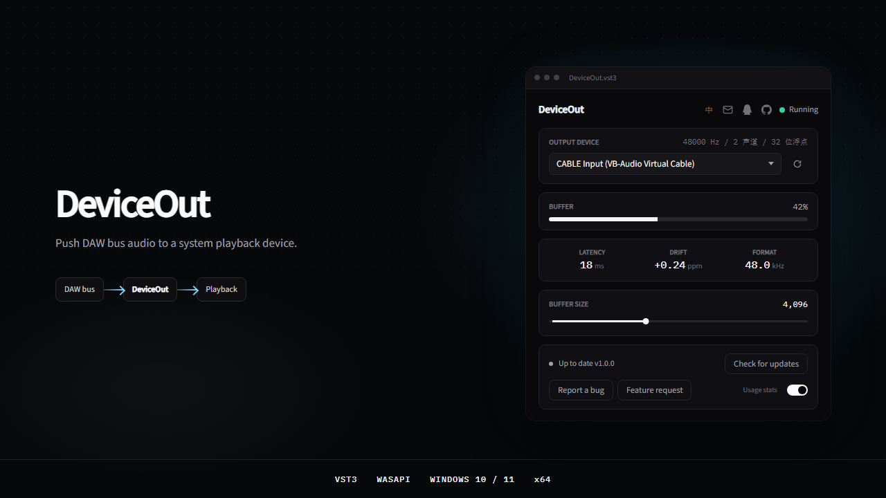
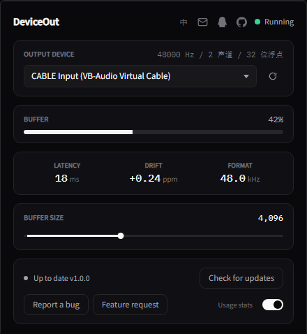

# DeviceOut

[English](README.md) | [中文](README.zh-CN.md)

Windows VST3. Push DAW bus audio to a system playback device.

When the interface is running ASIO, you may still want the host’s processed output in Discord, OBS, and similar apps.

Under ASIO the host opens the device exclusively. That bus never enters the Windows audio session, so other programs cannot monitor it from the system side. The workaround is to send this audio to a loopback playback device (usually `CABLE Input`) and have those apps take the matching capture device (`CABLE Output`).

## Requirements

- Windows 10 / 11, 64-bit
- A VST3 host (Studio One, REAPER, Cubase, and others)
- A loopback driver if you need a virtual mic. [VB-Audio Cable](https://vb-audio.com/Cable/) is recommended

## Install VB-Cable

1. Open [https://vb-audio.com/Cable/](https://vb-audio.com/Cable/)
2. Download the free **VB-CABLE Driver**
3. Unzip and run `VBCABLE_Setup_x64.exe` as administrator
4. Reboot if Windows asks

Windows then adds two devices:

- **CABLE Input** — playback
- **CABLE Output** — capture (the mic for voice apps)

Any other loopback driver works the same way. VB is not required.

## Install DeviceOut

Run the installer. Restart the host or rescan plugins.

## Usage

1. Insert DeviceOut on a track or the master
2. Set **OUTPUT DEVICE** to `CABLE Input`
3. In Discord / OBS / other voice apps, set the microphone to `CABLE Output`

