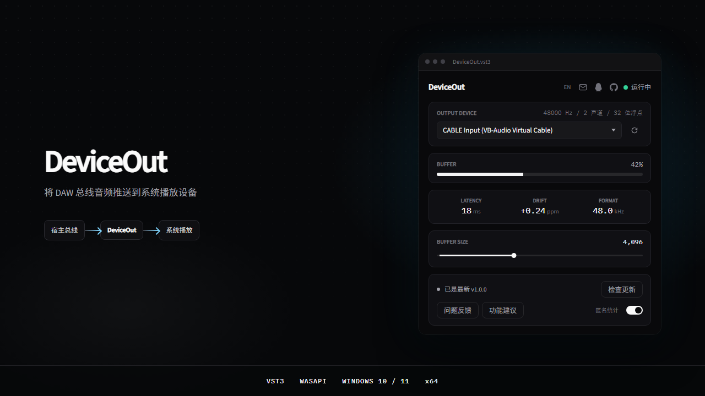
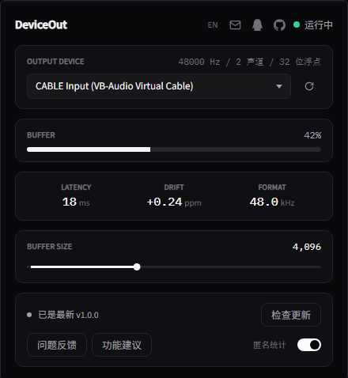

# DeviceOut

[English](README.md) | [中文](README.zh-CN.md)

Windows VST3 将 DAW 总线音频推送到系统播放设备

在使用声卡 ASIO 时，又想把宿主处理后的音频实时接到 Discord、OBS 这类软件。

ASIO 下宿主独占音频设备，该总线不会进入 Windows 音频会话，其它程序无法从系统侧监听。因此需要把这段音频送到回环播放设备（一般为 `CABLE Input`），再由这些软件从对应的录音设备（`CABLE Output`）接入。

## 系统

- Windows 10 / 11，64 位
- 支持 VST3 的宿主软件（如 Studio One、REAPER、Cubase 等）
- 要当虚拟麦需要回环驱动，推荐 [VB-Audio Cable](https://vb-audio.com/Cable/)

## 安装 VB-Cable

1. 打开 [https://vb-audio.com/Cable/](https://vb-audio.com/Cable/)
2. 下载免费的 **VB-CABLE Driver**
3. 解压后以管理员运行 `VBCABLE_Setup_x64.exe`
4. 如系统提示，重启一次

装好后 Windows 会多出两个设备：

- **CABLE Input**：播放设备
- **CABLE Output**：录音设备（给语音软件当麦克风）

自己有别的回环驱动也可以，不必非用 VB。

## 安装 DeviceOut

运行安装程序即可。装完重启宿主软件或重新扫描插件。

## 用法

1. 把 DeviceOut 挂在轨道或总线上
2. **OUTPUT DEVICE** 选 `CABLE Input`
3. Discord / OBS / 其它语音软件的麦克风选 `CABLE Output`

